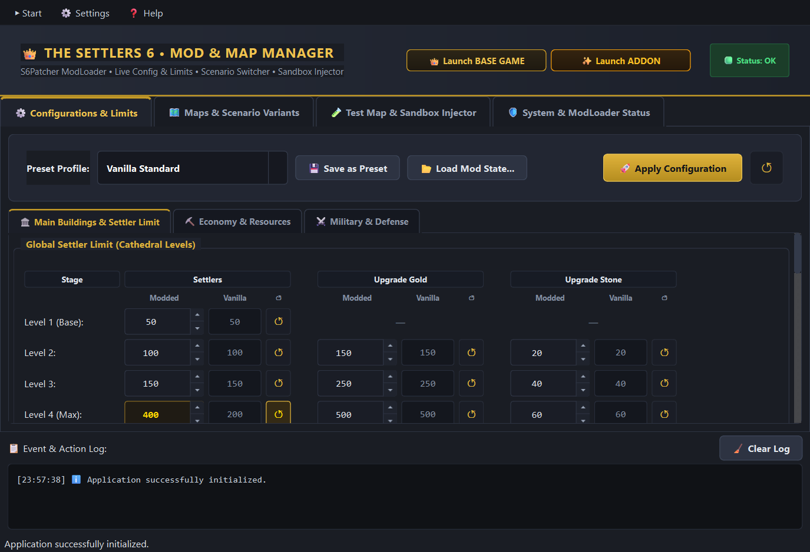
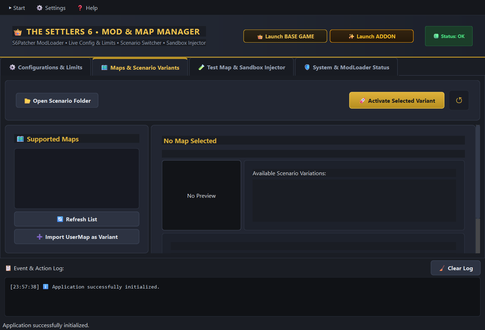
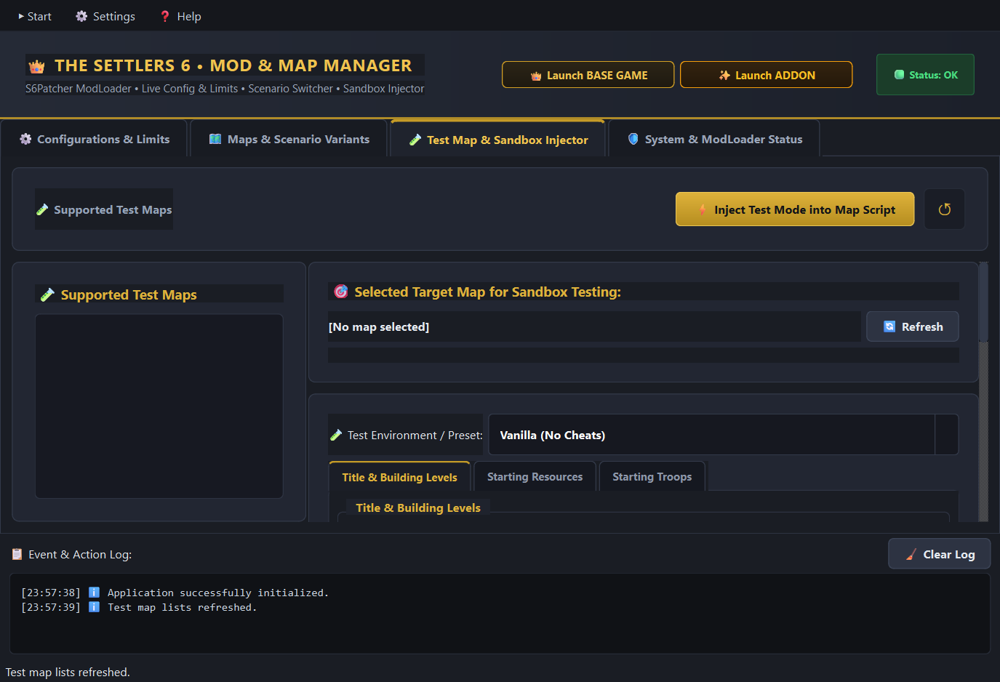
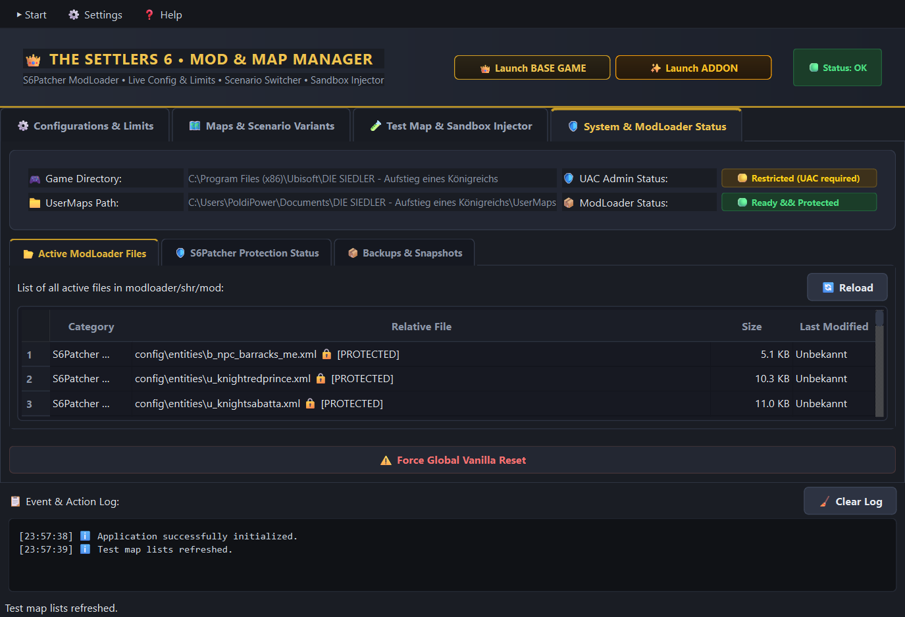
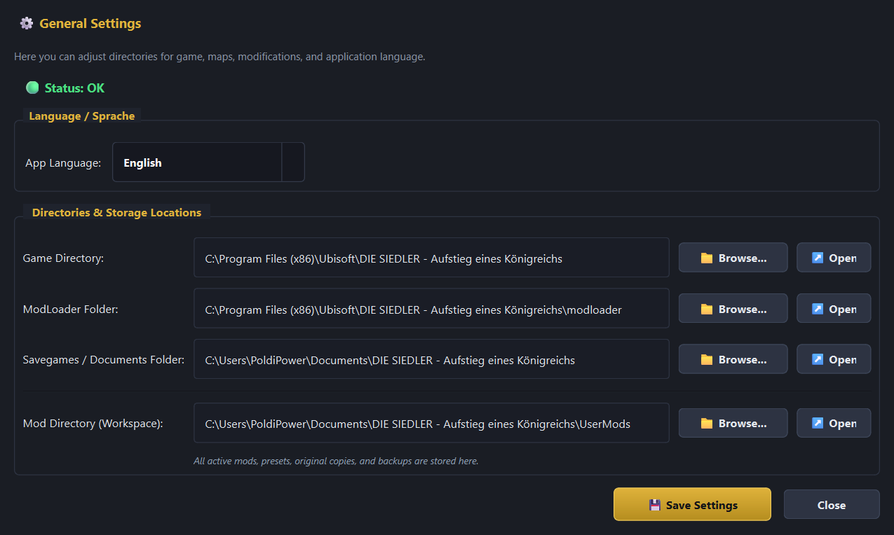

# 👑 Die Siedler 6: Mod & Map Manager (S6Patcher Edition)

> **Die Siedler 6 - Mod Manager**  
> Präsentiert von **Leopold Walli AI Software Productions**  
> **Version 1.1** (Build `20260911`)  
>  
> *Hinweis:* Diese Software wurde nach hohen Qualitätsstandards implementiert. Dennoch wurde sie rein durch KI („vibe coded“) entwickelt; daher verstehe ich die Risiken bei der Nutzung vollständig. Ich kann die Korrektheit des Codes selbst mithilfe von KI-Tools testen und überprüfen. Der Autor übernimmt keine Haftung für etwaige Softwareschäden.

[](README.md)
[](README.de.md)

**Sprache / Language:** [🇬🇧 English](README.md) | [🇩🇪 Deutsch](README.de.md)

Ein moderner, eigenständiger Desktop-Manager mit **PyQt6** für *Die Siedler: Aufstieg eines Königreichs* (The Settlers - Rise of an Empire).  
Ermöglicht Live-Konfigurationen des Spiels (Siedlerlimit, Lager, Burgen, Minen), Szenario- und Map-Switching mit mehreren Abwandlungen sowie eine High-Tier-Sandbox für schnelles Entwickeln und Testen.

<p align="center">
  
</p>

---

## 📸 Visuelle Übersicht & Screenshots

| Bereich | Vorschau | Beschreibung |
|---|---|---|
| **Live-Konfiguration & Limits** |  | Dynamische Siedlerlimits (bis 5.000+ Siedler), anpassbare Lagerkapazitäten, Ausbau-Kostenmatrizen und unerschöpfliche Minen. |
| **Karten & Szenario-Varianten** |  | Nahtloses Umschalten zwischen vorhandenen Karten und benutzerdefinierten Community-Varianten mit 1 Klick. |
| **Sandbox & Test-Injektor** |  | Test-Setups mit sofortigem Herzog-Rang, 50.000 Startgold, gefüllten Lagern und vollständiger Kartenaufdeckung (Fog of War Reveal). |
| **System-Status & S6Patcher-Schutz** |  | Live-Dateimonitor für den ModLoader, Schutz unverzichtbarer Dateien, UAC-Statusanzeige und 1-Klick-ZIP-Snapshots/Backups. |
| **Einstellungen & Zweisprachigkeit** |  | Sofortige Sprachumschaltung (Deutsch / Englisch) und automatische Pfaderkennung für Spiel-, Modloader- und Dokumentenordner. |

---

## ✨ Hauptfunktionen

### 1. ⚙️ Live-Konfigurationseditor & Spiel-Limits
* **Globales Siedlerlimit (`logic.xml`):** Anheben des Bevölkerungslimits von 200 (Vanilla) auf 500 bis 5.000+ Siedler je Kathedralenstufe.
* **Lagerhaus & Burgen (Stufen 1–4):** Frei einstellbare Lagerkapazitäten (bis 5.000), erweiterte Soldatenlimits (bis 500), 99.000 Gold Schatzkammer und konfigurierbare Ausbaukosten (Gold & Stein).
* **Unendliche Rohstoff-Minen:** 1-Klick-Option, um Steinbrüche und Eisenminen auf unerschöpfliche Kapazität (999.999) zu setzen.
* **Militär & Befestigung:** Anpassbare Bataillonsgrößen (6, 9 oder 12 Soldaten pro Trupp), verdreifachte Trefferpunkte für Tore, Türme und Stadtmauern.
* **Preset-Verwaltung:** Vorkonfigurierte Profile (`Vanilla`, `Erweitert`, `Extrem`) und Speichern eigener Tuning-Sets.

### 2. 🗺️ Karten & Szenario-Varianten-Manager
* **Karten-Bibliothek:** Übersicht über unterstützte Einzelspieler- und Kampagnenkarten.
* **Abwandlungen & Varianten:** Verwalte mehrere Modifikationen derselben Karte (z. B. *Vanilla* vs. individuelle Balancing- oder Herausforderungs-Editionen).
* **UserMap-Import:** 1-Klick-Zuweisung selbsterstellter Karten aus `UserMaps` als Ersatz oder Variante einer Originalkarte.
* **Non-Destruktiv:** Das Zurücksetzen auf Vanilla entfernt lediglich die ModLoader-Overrides, sodass die Original-Dateien des Spiels unberührt bleiben.

### 3. 🧪 Testmap & Sandbox-Injektor (High-Tier Testing)
* **Sofortiger Herzog-Titel (Stufe 6):** Schaltet in Sekunde 1 alle Ausbaustufen und Gebäude frei.
* **Startkapital & Rohstoffe:** 50.000 Gold und 500 Ressourcen aller Warenarten.
* **Start-Lagerhaus:** Direktes Vollbeladen mit Holz, Stein und Eisen.
* **Nebel des Krieges (Fog of War Reveal):** Komplette Aufdeckung der Karte für Tests.
* **Rückstandsfreie Bereinigung:** Stellt Originalskripte bei Deaktivierung restlos wieder her.

### 4. 🛡️ System-Status, S6Patcher-Schutz & Backups
* **Integritätsüberwachung:** Schutz der unverzichtbaren S6Patcher-Basisdateien vor versehentlichem Löschen.
* **Dateiliste:** Übersicht aller aktiven Modifikationen im ModLoader.
* **1-Klick-Backups:** Erstellen und Wiederherstellen komprimierter ZIP-Snapshots des ModLoaders.

## 📋 Voraussetzungen & Vorbereitung (Wichtig!)

Bevor du den ModManager installierst und startest, stelle sicher, dass dein Spiel gepatcht und der ModLoader aktiviert ist:

1. **Die Siedler 6 auf die neueste Version patchen:**
   * Stelle sicher, dass sowohl das Basisspiel als auch das Add-on (*Reich des Ostens* / *Eastern Realm*) auf dem neuesten offiziellen Stand sind (z. B. Patch 1.7.1 für das Basisspiel / Patch 2.1 für Reich des Ostens).
2. **Das Spiel einmalig starten:**
   * Starte *Die Siedler 6* mindestens einmal bis ins Hauptmenü, bevor du Mods installierst. Dadurch werden alle benötigten Benutzerordner (`Dokumente\DIE SIEDLER...`), Konfigurationsdateien und Windows-Registry-Einträge sauber initialisiert.
3. **Siedler 6 ModLoader (S6Patcher) ausführen & aktivieren:**
   * Starte den offiziellen **S6Patcher** (Siedler 6 ModLoader).
   * Führe das Patchen des Spiels durch und **aktiviere die Mods** (hierdurch wird die `modloader\`-Ordnerstruktur im Spielverzeichnis angelegt).
4. **Bereit für den ModManager:**
   * Sobald der ModLoader aktiv ist, kannst du mit der Einrichtung des ModManagers wie folgt fortfahren.

---

## 🚀 Installation & Start (Standalone & Portabel)

Der Siedler 6 ModManager ist als **vollständig eigenständiges, portables Tool** aufgebaut.

### Empfohlener Speicherort:
Entpacke oder kopiere den Ordner **`ModManager`** am besten direkt in deinen Siedler 6 Mod-Ordner:  
📁 `Dokumente\DIE SIEDLER - Aufstieg eines Königreichs\UserMods\ModManager`  
*Hinweis:* Das Tool funktioniert auch an jedem beliebigen anderen Ort (z. B. Desktop oder Programme). Backups und Spiel-Wiederherstellungspunkte werden für maximale Sicherheit stets im Savegame-Bereich deiner Dokumente gesichert, sodass deine Daten auch bei Löschen des ModManagers erhalten bleiben.

### 1. Einrichten & Installieren
Starte für die Ersteinrichtung die Installationsdatei:
```cmd
INSTALL.bat
```
* **Automatisch:** Prüft Python und PyQt6 und installiert fehlende Abhängigkeiten automatisch.
* **Setup-Assistent:** Bietet zweisprachige Menüführung (Englisch / Deutsch), Desktop-Verknüpfung sowie die Option, eine lokale `.exe` zu kompilieren.

### 2. Tägliches Starten
Starte die Anwendung einfach per Doppelklick:
```cmd
START_MOD_MANAGER.bat
```
Oder direkt via Python:
```bash
python src/ModManager/main.py
```

---

## 🧠 Eigene Szenario-Varianten mit KI erstellen (KI-gestützter Modding-Workflow)

Du brauchst keine komplizierten 3D-Karten-Editoren, um neue Spielmodi für *Die Siedler 6* zu erschaffen. Der gesamte Ablauf einer Mission, die Diplomatie, Händlerangebote, Start-Rohstoffe und Angriffswellen werden rein über **Lua-Skripte** (`mapscript.lua`) gesteuert.

Mit modernen KI-Assistenten (wie Antigravity, Gemini, ChatGPT oder Claude) kannst du im Handumdrehen eigene Szenario-Varianten erstellen und iterieren.

### Der 4-Schritte-Workflow für Szenarien:

#### 1. Basiskarte wählen & Varianten-Ordner anlegen
Navigiere in deiner ModManager-Installation zu `src/ModManager/Scenarios/` (oder in deinen Workspace) und wähle eine Karten-ID (z. B. `beispiel_karte`):
```text
Scenarios/beispiel_karte/
├── vanilla/
│   └── scenario.json
└── meine_ki_survival_mod/
    ├── scenario.json
    ├── map/
    │   ├── mapscript.lua      # Deine KI-generierte Spiellogik
    │   └── info.xml           # Karten-Infos & Anzeigename
    └── text/de/maps/          # Optional: Eigene deutsche Missionsbeschreibung
        └── map_beispiel_karte.xml
```

#### 2. Metadaten in `scenario.json` anlegen
Erstelle eine kleine JSON-Datei, damit der ModManager deine Variante erkennt und im Menü anzeigt:
```json
{
  "id": "meine_ki_survival_mod",
  "title": "Banditen-Belagerung: 20 Angriffswellen",
  "author": "DeinName & KI",
  "description": "Verteidige deine Stadt gegen koordinierte Angriffe alle 5 Minuten und erfülle die Kloster-Lieferkette.",
  "is_vanilla": false
}
```

#### 3. Prompting für deinen KI-Assistenten (Prompt-Vorlagen)
Kopiere Funktionen aus einer bestehenden `mapscript.lua` (z. B. `Mission_InitPlayers` oder `Mission_FirstMapAction`) in deinen KI-Prompt:

* **Prompt-Beispiel 1 (Angriffswellen & Raids):**  
  > *"Hier ist die Basis-`mapscript.lua` von Die Siedler 6. Ich möchte ein wiederkehrendes Angriffs-Event hinzufügen: Spawne alle 6 Minuten 2 Schwertkämpfer- und 1 Bogenschützen-Bataillon am Banditenlager, die mit `Logic.CreateBattalionOnUnblockedLand` auf das Lagerhaus von Spieler 1 marschieren."*

* **Prompt-Beispiel 2 (Hardcore-Wirtschaft & Mangel):**  
  > *"Passe `Mission_InitPlayers` und `Mission_InitMerchants` an: Spieler 1 startet mit 0 Stein und nur 10 Holz. Erstelle eine Lieferquest, bei der das Abliefern von 20 Brot an das Kloster mit 50 Stein belohnt wird."*

* **Prompt-Beispiel 3 (Totaler Krieg / Jeder gegen Jeden):**  
  > *"Passe `Mission_SetDiplomacy` an, sodass alle NPC-Städte sofort mit `DiplomacyStates.Enemy` starten. Gib jeder Feindstadt in `Mission_FirstMapAction` 3 zusätzliche Verteidigungs-Bataillone."*

#### 4. Sofortiges Testen & Schnelle Iteration (Sandbox-Integration)
1. Öffne den ModManager &rarr; wechsle zum Reiter **Karten & Szenario-Varianten**.
2. Klicke auf **Liste aktualisieren** &rarr; deine neue KI-Variante erscheint sofort in der Liste.
3. Klicke auf **Ausgewählte Variante aktivieren** &rarr; der Manager verpackt sie sekundenschnell in die `mod.bba`.
4. 💡 **Pro-Tipp für schnelles Testen:** Wechsle kurz in den Reiter **Testmap & Sandbox-Injektor**, schalte den Herzog-Titel und Rohstoff-Boost ein, starte das Spiel und teste deine neue Skript-Logik sofort, ohne vorher 40 Minuten deine Siedlung aufbauen zu müssen!

---

## 📁 Projekt- & Verzeichnis-Struktur

```text
ModManager/
├── INSTALL.bat                     # Einrichtungs-Assistent mit UAC & Auto-Prüfung
├── START_MOD_MANAGER.bat           # 1-Klick-Direktstarter
├── README.md                       # Englische Dokumentation
├── README.de.md                    # Deutsche Dokumentation
├── LICENSE                         # Open-Source-Lizenz (MIT)
├── .gitignore                      # Git-Ausschlussregeln
│
└── src/ModManager/                 # Kernanwendung & Module
    ├── main.py                     # Haupteinstiegspunkt
    ├── app_window.py               # Hauptfenster mit Tab-Verwaltung & Konsole
    ├── setup_assistant.py          # Zweisprachiger Einrichtungs-Assistent
    ├── utils.py                    # Pfad- und System-Hilfsfunktionen
    ├── tab_config.py               # Tab 1: Live Config Editor & Presets
    ├── tab_scenarios.py            # Tab 2: Szenario- & Karten-Manager
    ├── tab_sandbox.py              # Tab 3: Sandbox Injektor
    ├── tab_system.py               # Tab 4: System-Status & Backup-Manager
    ├── dialog_settings.py          # Einstellungsdialog
    ├── dialog_startup_setup.py     # Ersteinrichtungs- und Entpackdialog
    ├── engines/                    # Backend-Logik
    │   ├── system_engine.py
    │   ├── config_engine.py
    │   ├── scenario_engine.py
    │   ├── sandbox_engine.py
    │   └── i18n_engine.py
    ├── patcher/                    # BBA-Packer und Archiv-Verwaltung
    ├── locales/                    # Zweisprachiges Wörterbuch (dictionary.json)
    ├── styles/                     # Dark Theme Stylesheet (theme.qss)
    ├── assets/                     # Grafiken & Programm-Icons
    ├── tools/                      # Hilfstools & Dienstprogramme
    ├── Presets/                    # Balancing-Profile (Vanilla, Erweitert, Extrem)
    ├── Scenarios/                  # Szenario-Bibliothek mit Varianten
    └── tests/                      # Automatisierte Testsuite (34 Tests)
```

---

## 🧪 Tests ausführen

Die gesamte Testsuite kann mit folgendem Befehl ausgeführt werden:
```powershell
$env:PYTHONPATH="src"; python -m unittest discover -s "src\ModManager\tests" -p "test_*.py" -v
```

---

## 📜 Lizenz & Credits

**Die Siedler 6 - Mod Manager**  
Präsentiert von **Leopold Walli AI Software Productions**  
Version 1.1 (Build 20260911)

Dieses Projekt ist Open Source und lizenziert unter der [MIT-Lizenz](LICENSE).
